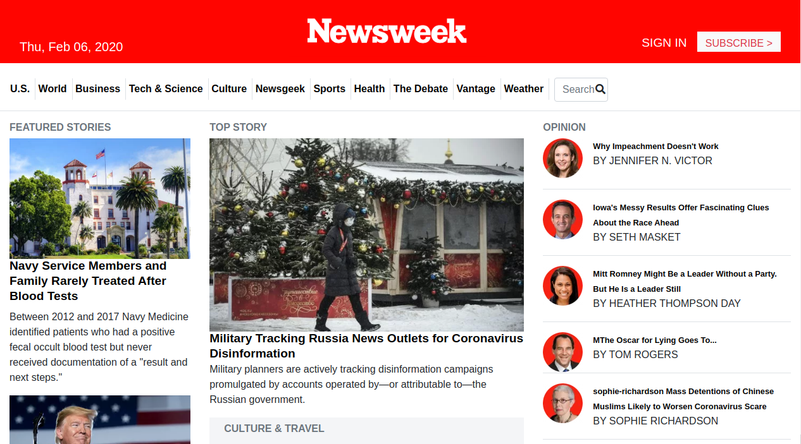

 

# newsweek

Building a web page that is similar to the newsweek web page with responsive web design

## Built With

- HTML
- CSS/Bootstrap 4

## Screenshort

## Live Demo

[Live Demo](https://theophile-kango.github.io/newsweek/)

## Getting Started

To get a local copy up and running follow these simple example steps.
- Clone the project unto your local machine
- `cd` into the project directory
- Open up index.html in your browser to view the project

👤  **Theophile Kango**

- Github: [@githubhandle](https://github.com/Theophile-Kango)
- Twitter: [@twitterhandle](https://twitter.com/Theophadh)
- Linkedin: [linkedin](https://www.linkedin.com/in/theophile-kango)

## 🤝 Contributing

Feel free to check the [issues page](https://github.com/Theophile-Kango/newsweek/issues).

## Show your support

Give a ⭐️ if you like this project!

## 📝 License

This project is licensed by Microverse.

### Enjoy!
